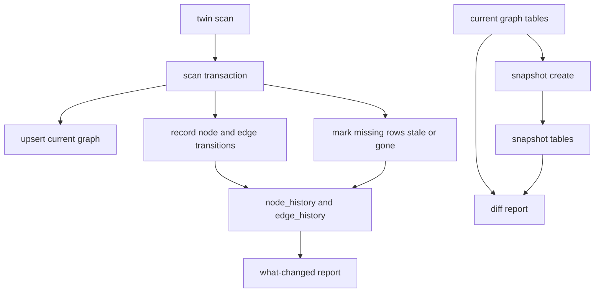

# Slice 12 Implementation Plan

Target repository document after approval: [`docs/imp-plan/slice-12.md`](/home/kali/proj/twin-ops/docs/imp-plan/slice-12.md). This plan is based on the shipped layout in [`docs/code-layout.md`](/home/kali/proj/twin-ops/docs/code-layout.md), the product/technical requirements in [`docs/prd.md`](/home/kali/proj/twin-ops/docs/prd.md) and [`docs/tech-document.md`](/home/kali/proj/twin-ops/docs/tech-document.md), the slice definition in [`docs/plan-slices.md`](/home/kali/proj/twin-ops/docs/plan-slices.md), and the current slice 10/11 implementation state.

## 1. Overview

Slice 12 should make `twin` answer:

```text
What appeared, disappeared, or changed since my last operational checkpoint, and how does the current graph differ from a named snapshot?
```

Working demo:

```bash
twin scan
twin what-changed --since 10m
twin snapshot create before-change
twin snapshot list
twin diff snapshot:before-change current
```

Ideal outcome:

1. Repeated scans update graph history atomically with the scan transaction.
2. `what-changed` reports new, disappeared, stale, and changed graph entities since a user-supplied time window.
3. `snapshot create NAME` records a named, immutable copy of the current materialized graph in SQLite.
4. `snapshot list` shows stable names, creation time, node count, and edge count.
5. `diff snapshot:NAME current` compares two graph views and renders useful additions, removals, and changes.
6. The temporal model remains evidence-aware and read-only: no VM snapshots, no filesystem snapshots, no service operations, no host mutation.
7. Tests use realistic fixture transitions: a process appears, a port disappears, a service edge changes, and a snapshot is compared to current.

This slice should turn the existing SQLite graph into operational memory. It should not build a general graph analytics engine, retention daemon, file inventory system, or config parser.

## 2. Current Starting Point

Already available:

- The current schema has temporal-ready columns on `nodes`: `state`, `first_seen_ns`, `last_seen_ns`, `valid_from_ns`, `valid_to_ns` in [`crates/twin-store/src/migration/mod.rs`](/home/kali/proj/twin-ops/crates/twin-store/src/migration/mod.rs).
- `NodeState` and `EdgeState` already support `Active`, `Stale`, and `Gone` in [`crates/twin-core/src/node.rs`](/home/kali/proj/twin-ops/crates/twin-core/src/node.rs) and [`crates/twin-core/src/edge.rs`](/home/kali/proj/twin-ops/crates/twin-core/src/edge.rs).
- `Store::upsert_node` preserves `first_seen_ns` and `valid_from_ns`, then updates `last_seen_ns`, `state`, `valid_to_ns`, and metadata in [`crates/twin-store/src/repo/node.rs`](/home/kali/proj/twin-ops/crates/twin-store/src/repo/node.rs).
- `Store::upsert_edge` preserves the edge row identity and updates active graph fields in [`crates/twin-store/src/repo/edge.rs`](/home/kali/proj/twin-ops/crates/twin-store/src/repo/edge.rs).
- `scan.rs` already persists a full scan pass inside `Store::with_transaction`, which is the right boundary for history updates.
- CLI/app/output patterns are established in [`crates/twin-cli/src/cli/args.rs`](/home/kali/proj/twin-ops/crates/twin-cli/src/cli/args.rs), [`crates/twin-cli/src/main.rs`](/home/kali/proj/twin-ops/crates/twin-cli/src/main.rs), and command-specific renderers under [`crates/twin-cli/src/output/`](/home/kali/proj/twin-ops/crates/twin-cli/src/output/).

Missing:

- `node_history`, `edge_history`, `snapshots`, `snapshot_nodes`, and `snapshot_edges` tables.
- Store repository methods for history ranges, snapshots, graph-view loading, and diff inputs.
- A `SnapshotId` domain newtype.
- Scan logic that records changed rows and marks unseen rows stale/gone.
- `what-changed`, `snapshot`, and `diff` app commands, CLI args, human output, JSON output, and tests.

## 3. Scope

This slice does:

- Add `MIGRATION_004` with history and snapshot tables.
- Add narrow store repositories for temporal queries and snapshot persistence.
- Add `SnapshotId` as a typed ID for external `snapshot:NAME` refs and validated internal names.
- Record graph changes during scan, in the same transaction as observation/node/edge upserts.
- Track new, changed, stale, gone, and reappeared rows based on graph row transitions.
- Add `twin what-changed --since DURATION`.
- Add `twin snapshot create NAME` and `twin snapshot list`.
- Add `twin diff LEFT RIGHT`, where refs are `current` or `snapshot:NAME`.
- Render polished human output and stable JSON.
- Update [`docs/state/slice-12.md`](/home/kali/proj/twin-ops/docs/state/slice-12.md) throughout implementation.

This slice does not:

- Implement config file content hash tracking. That is explicitly planned for slice 19 with `twin-config`; slice 12 should not fake a file hash if the collector does not prove it.
- Add broad filesystem crawling, package history, container history, Kubernetes history, or eBPF history.
- Add a retention/compaction background job. It may add repository methods that make future pruning straightforward, but it should not run pruning automatically.
- Add a `twin-graph` crate. App-level graph loading is enough until duplication becomes real.
- Auto-run scans from `what-changed`, `snapshot`, or `diff`. These commands should read the stored graph/history. Users run `twin scan` explicitly when they want to refresh operational memory.
- Treat named snapshots as OS snapshots. They are SQLite graph copies only.

## 4. Architecture



Core principle: the materialized `nodes` and `edges` tables remain the current graph. History tables store transitions and enough row data to explain what changed. Snapshot tables store immutable copies of graph rows at named moments.

## 5. Data Model

Add `MIGRATION_004` in [`crates/twin-store/src/migration/mod.rs`](/home/kali/proj/twin-ops/crates/twin-store/src/migration/mod.rs), then bump `LATEST_VERSION` to `4`.

New tables:

- `node_history`
  - `id INTEGER PRIMARY KEY AUTOINCREMENT`
  - `node_id`, `kind`, `label`, `state`
  - `first_seen_ns`, `last_seen_ns`, `valid_from_ns`, `valid_to_ns`
  - `metadata_json`
  - `change_kind`: `new`, `changed`, `stale`, `gone`, `reappeared`
  - `recorded_at_ns`
  - `collector_run_id` nullable FK to `collector_runs`

- `edge_history`
  - `id INTEGER PRIMARY KEY AUTOINCREMENT`
  - `edge_id`, `from_node_id`, `to_node_id`, `kind`, `class`, `state`
  - `evidence_score`, `evidence_label`, `evidence_count`
  - `first_seen_ns`, `last_seen_ns`, `metadata_json`
  - `change_kind`: `new`, `changed`, `stale`, `gone`, `reappeared`
  - `recorded_at_ns`
  - `collector_run_id` nullable FK to `collector_runs`

- `snapshots`
  - `name TEXT PRIMARY KEY`
  - `created_at_ns INTEGER NOT NULL`
  - `node_count INTEGER NOT NULL`
  - `edge_count INTEGER NOT NULL`

- `snapshot_nodes`
  - composite primary key `(snapshot_name, node_id)`
  - full node row copy
  - FK `snapshot_name` to `snapshots(name)` with cascade delete

- `snapshot_edges`
  - composite primary key `(snapshot_name, edge_id)`
  - full edge row copy
  - FK `snapshot_name` to `snapshots(name)` with cascade delete

Add indexes for common queries:

- `idx_node_history_recorded`
- `idx_node_history_node`
- `idx_node_history_change_kind`
- `idx_edge_history_recorded`
- `idx_edge_history_edge`
- `idx_snapshot_nodes_snapshot`
- `idx_snapshot_edges_snapshot`

Avoid storing observation bodies in snapshots. Snapshots preserve graph state, not raw evidence logs.

## 6. State Semantics

Use existing states deliberately:

- `Active`: observed in the latest completed scan pass or intentionally retained as current graph state.
- `Stale`: not observed in a scan where coverage was degraded enough that absence should not be treated as a confident disappearance.
- `Gone`: confidently absent from the latest final scan pass for the relevant collector/source.

Use user-facing wording carefully:

- `New`: row was absent before and is now active.
- `Disappeared`: row transitioned to `gone`.
- `Stale`: row was not observed, but scan quality prevents a confident disappearance claim.
- `Changed`: stable row identity with changed label, metadata, class, evidence fields, or state.
- `Reappeared`: previously stale/gone row observed active again.

Do not claim file content changes unless file metadata actually changes. Broad config hash tracking belongs to slice 19.

## 7. Store Repositories

Add focused store modules:

- [`crates/twin-store/src/repo/history.rs`](/home/kali/proj/twin-ops/crates/twin-store/src/repo/history.rs)
  - `insert_node_history`
  - `insert_edge_history`
  - `list_node_history_since`
  - `list_edge_history_since`
  - `mark_nodes_missing_since`
  - `mark_edges_missing_since`
  - `list_current_nodes`
  - `list_current_edges`

- [`crates/twin-store/src/repo/snapshot.rs`](/home/kali/proj/twin-ops/crates/twin-store/src/repo/snapshot.rs)
  - `create_snapshot`
  - `list_snapshots`
  - `load_snapshot_nodes`
  - `load_snapshot_edges`
  - `snapshot_exists`

Keep `twin-store` as a storage layer: it should not decide product wording, risk, or CLI layout. It can compare raw rows and return typed row-level changes.

## 8. Scan Integration

Update [`crates/twin-app/src/commands/scan.rs`](/home/kali/proj/twin-ops/crates/twin-app/src/commands/scan.rs) around the existing transaction.

Implementation shape:

1. Track all node IDs and edge IDs seen during the scan pass.
2. When upserting a node or edge, compare the existing row to the new row before writing.
3. Insert a history row when the row is new, materially changed, or reappeared.
4. After all current observations and inferred edges are upserted, mark previously active rows not seen in this final scan pass as `Gone` or `Stale` and insert history rows for those transitions.
5. For multi-sample scans, only run missing-row finalization on the final sample to avoid temporary sample gaps creating false disappearances.
6. If collector coverage is degraded for a class of rows, prefer `Stale` over `Gone` and expose that uncertainty in `what-changed`.

Do not hard-delete scan-managed edges merely because they are missing from the current pass. For existing correction paths that already call `delete_edge`, record `edge_history` before deleting or convert them to state transitions if doing so does not break current graph output.

Default current graph views should ignore non-active rows unless a temporal command explicitly asks for history. If a current graph command would otherwise show `gone` nodes, filter to active rows in app-level queries.

## 9. Command Design

### `what-changed`

CLI:

```bash
twin what-changed --since 10m
twin what-changed --since 1h
twin what-changed --since yesterday
```

Request fields:

- `since`: parsed into `since_ns`
- optional `--config`, matching existing command patterns

Parser behavior:

- Support `s`, `m`, `h`, and `d` duration suffixes.
- Support `yesterday` as `now - 24h` for the PRD demo.
- Reject empty, zero, negative, unknown-unit, and unreasonably huge durations with typed app errors.

Result model:

- `since_ns`
- `generated_at_ns`
- `new_nodes`, `new_edges`
- `disappeared_nodes`, `disappeared_edges`
- `stale_nodes`, `stale_edges`
- `changed_nodes`, `changed_edges`
- `reappeared_nodes`, `reappeared_edges`
- `unknowns` for degraded scan coverage that weakens absence claims

Human output should be compact:

```text
Changes since 10m

New
├── process:pid:2241 python
└── port:tcp:127.0.0.1:8000

Disappeared
└── service:redis.service

Changed
└── service:nginx.service state active -> stale
```

### `snapshot`

CLI:

```bash
twin snapshot create before-change
twin snapshot list
```

Name validation:

- Allow only ASCII letters, digits, `.`, `_`, and `-`.
- Reject empty names, whitespace, slash, colon, and reserved name `current`.
- Store the raw name in SQLite; parse external refs as `snapshot:NAME`.

`create` behavior:

- Require an initialized database.
- Require at least one current graph row unless an empty snapshot is explicitly accepted by the product. Prefer a clear error because empty snapshots are almost always user confusion.
- Insert the snapshot and row copies in one transaction.
- Reject duplicate names with a clear error. Do not overwrite unless a future slice adds `--replace`.

`list` behavior:

- Sort by `created_at_ns` descending or name ascending. Prefer created time descending because users usually want recent checkpoints first.
- Render name, age/time, node count, and edge count.

### `diff`

CLI:

```bash
twin diff snapshot:before-change current
twin diff snapshot:before-change snapshot:after-change
```

Ref behavior:

- `current` loads active rows from current `nodes` and `edges`.
- `snapshot:NAME` loads rows from snapshot tables.
- Reject unknown snapshots and malformed refs with clear typed errors.

Result model:

- `left_ref`, `right_ref`
- `nodes_added`, `nodes_removed`, `nodes_changed`
- `edges_added`, `edges_removed`, `edges_changed`
- per-change before/after summaries for label, state, metadata, edge class, and evidence changes

Human output:

```text
Graph diff: snapshot:before-change -> current

Added
└── port:tcp:127.0.0.1:8000

Removed
└── process:pid:2241 python

Changed
└── service:nginx.service state active -> stale
```

Keep diffs deterministic: sort by node/edge ID, then change kind.

## 10. App And CLI Files

Likely new app files:

- [`crates/twin-app/src/commands/what_changed.rs`](/home/kali/proj/twin-ops/crates/twin-app/src/commands/what_changed.rs)
- [`crates/twin-app/src/commands/snapshot.rs`](/home/kali/proj/twin-ops/crates/twin-app/src/commands/snapshot.rs)
- [`crates/twin-app/src/commands/diff.rs`](/home/kali/proj/twin-ops/crates/twin-app/src/commands/diff.rs)
- [`crates/twin-app/src/model/what_changed_result.rs`](/home/kali/proj/twin-ops/crates/twin-app/src/model/what_changed_result.rs)
- [`crates/twin-app/src/model/snapshot_result.rs`](/home/kali/proj/twin-ops/crates/twin-app/src/model/snapshot_result.rs)
- [`crates/twin-app/src/model/diff_result.rs`](/home/kali/proj/twin-ops/crates/twin-app/src/model/diff_result.rs)

Likely CLI files:

- [`crates/twin-cli/src/cli/what_changed.rs`](/home/kali/proj/twin-ops/crates/twin-cli/src/cli/what_changed.rs)
- [`crates/twin-cli/src/cli/snapshot.rs`](/home/kali/proj/twin-ops/crates/twin-cli/src/cli/snapshot.rs)
- [`crates/twin-cli/src/cli/diff.rs`](/home/kali/proj/twin-ops/crates/twin-cli/src/cli/diff.rs)
- [`crates/twin-cli/src/output/what_changed.rs`](/home/kali/proj/twin-ops/crates/twin-cli/src/output/what_changed.rs)
- [`crates/twin-cli/src/output/snapshot.rs`](/home/kali/proj/twin-ops/crates/twin-cli/src/output/snapshot.rs)
- [`crates/twin-cli/src/output/diff.rs`](/home/kali/proj/twin-ops/crates/twin-cli/src/output/diff.rs)

Update exports and dispatch in:

- [`crates/twin-app/src/lib.rs`](/home/kali/proj/twin-ops/crates/twin-app/src/lib.rs)
- [`crates/twin-app/src/commands/mod.rs`](/home/kali/proj/twin-ops/crates/twin-app/src/commands/mod.rs)
- [`crates/twin-app/src/model/mod.rs`](/home/kali/proj/twin-ops/crates/twin-app/src/model/mod.rs)
- [`crates/twin-app/src/error.rs`](/home/kali/proj/twin-ops/crates/twin-app/src/error.rs)
- [`crates/twin-cli/src/cli/args.rs`](/home/kali/proj/twin-ops/crates/twin-cli/src/cli/args.rs)
- [`crates/twin-cli/src/main.rs`](/home/kali/proj/twin-ops/crates/twin-cli/src/main.rs)
- [`crates/twin-cli/src/output/mod.rs`](/home/kali/proj/twin-ops/crates/twin-cli/src/output/mod.rs)
- [`crates/twin-cli/src/output/sections.rs`](/home/kali/proj/twin-ops/crates/twin-cli/src/output/sections.rs)

## 11. Quality Bar

The best implementation is small and durable:

1. History is recorded where truth enters the system: the scan transaction.
2. Snapshots are graph row copies, not host or filesystem snapshots.
3. Current graph commands remain current-focused and do not become noisy with stale/gone rows.
4. `what-changed` is useful even without file hashing because it reports graph row transitions honestly.
5. Diff output is deterministic and readable in terminals.
6. JSON has stable snake_case fields and typed arrays.
7. No new crate is added unless the implementation becomes genuinely hard to understand without it.
8. No dependency is added for time parsing; durations are simple enough for a pure helper.
9. No broad retention, background jobs, or scan auto-refresh is introduced.
10. Every user-visible absence claim remains cautious when scan coverage is degraded.

## 12. Test Plan

Keep tests high-signal and fixture-driven. Do not test every duration string, every node kind, or every possible edge kind if the behavior is identical.

Store tests:

1. `migration_004_creates_history_and_snapshot_tables`
   - verifies schema version 4 and all five tables.
2. `history_records_node_and_edge_transitions`
   - inserts representative node/edge history rows and queries by `since`.
3. `snapshot_create_copies_current_graph_rows`
   - creates a snapshot from active rows and verifies node/edge counts and copied row values.
4. `snapshot_duplicate_name_is_rejected`
   - proves snapshots are immutable named checkpoints.

App scan/history tests:

1. `repeated_scan_records_new_and_disappeared_process`
   - fake `/proc` sample A has a process; sample B removes it; `what_changed_in` reports disappeared.
2. `repeated_scan_records_reappeared_process`
   - process row goes gone/stale, then active again; result shows reappeared.
3. `scan_marks_missing_as_stale_when_coverage_degraded`
   - permission-degraded fixture does not overclaim disappearance.
4. `edge_history_records_listener_added_and_removed`
   - listener port appears/disappears across scan fixtures.
5. `unchanged_repeated_scan_does_not_duplicate_changed_rows`
   - repeated identical scan updates `last_seen` but does not flood history.

App command tests:

1. `what_changed_since_reports_new_changed_disappeared_sections`
   - use seeded history rows or fixture scans.
2. `snapshot_create_and_list_roundtrip`
   - create named snapshot, list it with counts.
3. `snapshot_rejects_invalid_or_duplicate_names`
   - only essential invalid cases: empty, reserved `current`, contains `:`.
4. `diff_snapshot_to_current_reports_added_removed_changed`
   - compare a snapshot with current active graph rows.
5. `diff_rejects_unknown_snapshot_ref`
   - clean typed error.

CLI output tests:

1. `what_changed_output_has_new_disappeared_changed_sections`
2. `snapshot_list_output_is_stable_and_readable`
3. `diff_output_shows_direction_and_grouped_changes`
4. JSON output tests for one representative result per command.

CLI integration tests:

1. `what_changed_after_fixture_scan_transition`
   - initialize isolated HOME, run scan on fake proc v1, run scan on fake proc v2, then run `what-changed --since 1h`.
2. `snapshot_create_list_and_diff_current`
   - create snapshot after v1 scan, run v2 scan, diff snapshot to current.
3. `commands_do_not_require_root_or_real_systemd`
   - use fake `/proc` and fixture systemd roots only.

Safety tests:

1. Extend forbidden-string coverage for new commands and store repositories.
2. Assert no code path uses mutating service/container/Kubernetes/file operations.
3. Assert snapshot creation writes only to the `twin` SQLite database, not the host filesystem outside the configured layout.

## 13. Acceptance Criteria

- [ ] `MIGRATION_004` creates `node_history`, `edge_history`, `snapshots`, `snapshot_nodes`, and `snapshot_edges`.
- [ ] Existing databases migrate cleanly from schema version 3 to 4.
- [ ] Repeated scans record new rows without resetting `first_seen_ns`.
- [ ] Repeated scans record meaningful changed rows without duplicating no-op history.
- [ ] Missing active nodes/edges are marked `gone` or `stale` according to scan coverage.
- [ ] Current graph/impact/emulate behavior ignores non-active rows unless intentionally showing temporal state.
- [ ] `twin what-changed --since 10m` renders new, disappeared, stale, changed, and reappeared sections as applicable.
- [ ] `what-changed` JSON includes structured node and edge changes.
- [ ] `twin snapshot create before-change` creates a named graph snapshot and does not overwrite an existing one.
- [ ] `twin snapshot list` renders snapshots with counts and creation timestamps.
- [ ] `twin diff snapshot:before-change current` renders added, removed, and changed graph rows.
- [ ] Diff supports snapshot-to-snapshot comparison if it falls out naturally from the graph-view loader.
- [ ] Invalid duration, snapshot name, and diff refs produce clean typed errors.
- [ ] No command performs OS snapshots, service restarts, process kills, file deletions, package operations, container mutations, or Kubernetes mutations.
- [ ] Tests use isolated HOME, temporary stores, fake `/proc`, and fixture systemd data.
- [ ] `docs/state/slice-12.md` is updated with status, decisions, deviations, acceptance checklist, and verification results.
- [ ] `cargo fmt --check` passes.
- [ ] `cargo test --workspace` passes.
- [ ] `cargo clippy --workspace -- -D warnings` passes.

## 14. Final Verification And Subagent Instructions

After implementation and normal verification, spawn a subagent for independent review before marking slice 12 complete.

Suggested subagent prompt:

```text
You are reviewing twin slice 12. Check the implementation against docs/imp-plan/slice-12.md, docs/state/slice-12.md, AGENTS.md, docs/prd.md, docs/tech-document.md, docs/plan-slices.md, and docs/code-layout.md.

Focus on:
1. read-only safety;
2. migration correctness and v3-to-v4 upgrade behavior;
3. scan transaction history recording;
4. stale/gone semantics under degraded coverage;
5. snapshot immutability;
6. diff correctness and deterministic ordering;
7. CLI output quality;
8. lean, meaningful tests.

Do not make broad refactors. Report findings with file and line references. If a small fix is obviously required, patch only that fix and rerun the smallest relevant verification command.
```

Then test the CLI on this system with real installed apps as a manual smoke test only:

```bash
cargo build
./target/debug/twin init
./target/debug/twin doctor
./target/debug/twin scan
./target/debug/twin what-changed --since 10m
./target/debug/twin snapshot create slice12-real-smoke
./target/debug/twin snapshot list
./target/debug/twin scan
./target/debug/twin diff snapshot:slice12-real-smoke current
./target/debug/twin graph --kind service
```

Expected manual-test behavior:

1. Commands may show no changes if the system is stable; that is acceptable and should render cleanly.
2. `snapshot create` should only write to the configured `twin` SQLite database.
3. `diff` should render a stable grouped report even when no differences exist.
4. If real services such as nginx, PostgreSQL, Redis, Docker, or systemd units exist on the host, they may appear as graph rows, but no command may restart, stop, reload, kill, delete, install, or mutate anything.
5. Record real-system observations and clean no-change outcomes in [`docs/state/slice-12.md`](/home/kali/proj/twin-ops/docs/state/slice-12.md).
